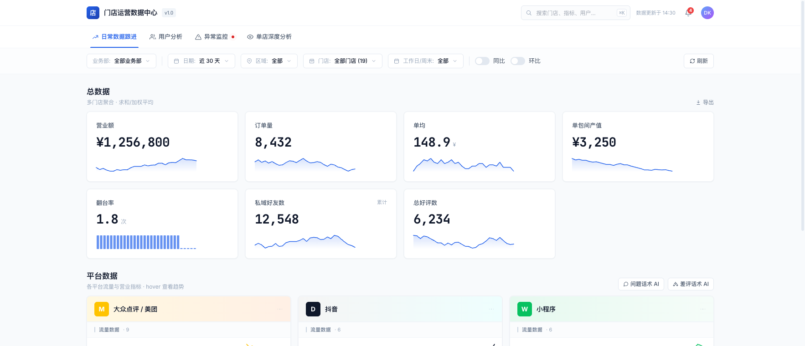
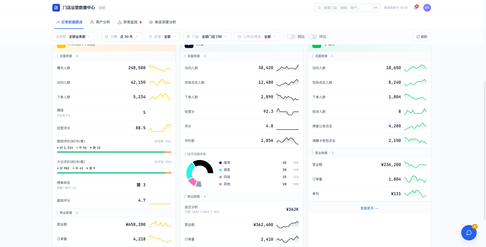
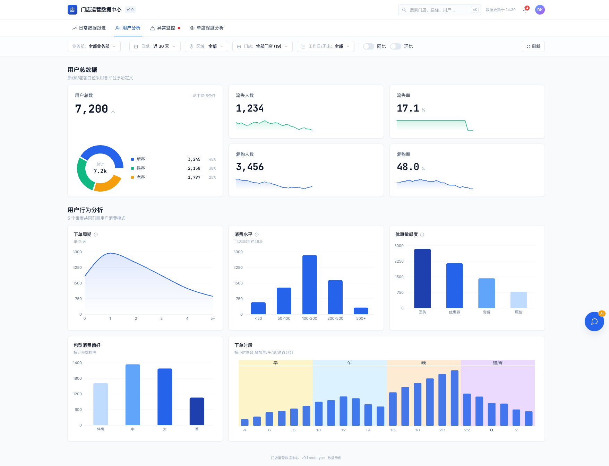
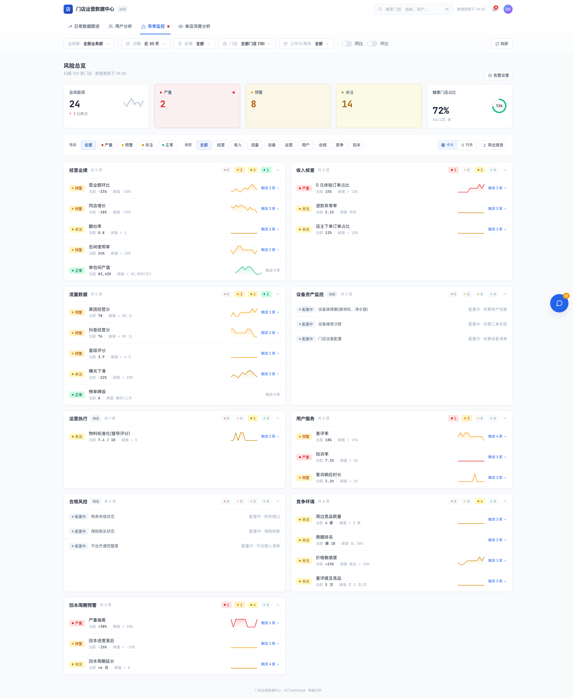
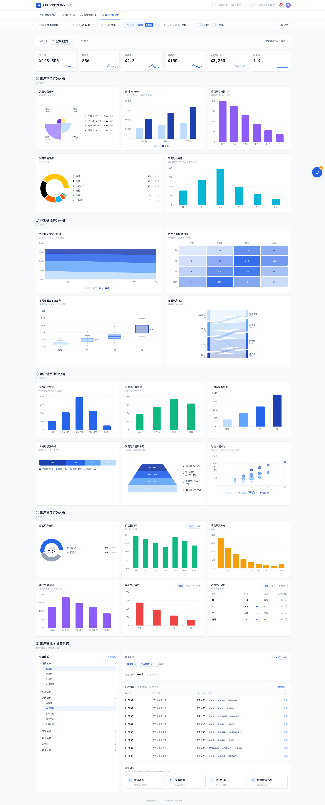

# 久雀到综数据口径与开发文档

> 日期：2026-06-04
> 客户：久雀
> 业务线：到综 / 到店综合 / 棋牌茶楼
> demo：https://jiuque.jingyingcanmou.cn/
> 依据：9 张后台截图 + 9 个实际下载 Excel 样本

## 0. 结论

久雀一期范围已确认：只接入美团经营宝和抖音来客的 Excel 可下载数据。本批样本已经足够启动一期 parser、数据表设计和 RPA 下载链路；美团经营宝侧覆盖门店客流、商品访问、品牌级商品交易、评价汇总、评价明细、榜单，抖音来客侧覆盖交易、商品、评价明细。

架构结论更新为“共享控制面 + 独立数据面 + 独立查询/页面层”：不为久雀单独新建数据库；`stores`、用户、权限、订阅、`platform_connections`、`platform_authorizations`、业务部、区域、门店归属继续共用现有体系，通过 `business_vertical='general'` 隔离。9 个 Excel 全部进入 `*_general_*` 到综 source 表，不再写入到餐现有事实表，避免字段语义、粒度和平台值污染。

到综查询层和页面层单独建设，不复用到餐 report builder 查询。`platform` 仍保持 `meituan`、`dianping`、`douyin`；“到店综合”不新增平台码。connector 需要到综专用采集路径，scheduler/BullMQ/浏览器 worker 可以复用，但取任务入口必须按 `business_vertical` 过滤。

一期建议建设“平台 Excel 经营看板”，覆盖 demo 的日常数据跟进、平台数据卡片、部分异常监控。demo 中的单包间产值、翻台率、私域好友、用户标签、用户列表、设备合规、回本周期，不能从本批美团/抖音 Excel 直接得到，需要二期接入小程序/POS/房型/会员/企微/财务数据。

截图说明：HTML 版本已把 `Image #1` 到 `Image #9` 放到 `assets/jiuque-daozong/`，并支持点击截图预览大图。Markdown 版本保留同样的图号锚点，方便和 HTML 对照。

## 1. 入口与样本总表

| 图号 | 平台 | 后台入口 | 下载动作 | Excel 样本 | 行数 | 数据粒度 | 建议 artifact_type |
| --- | --- | --- | --- | --- | ---: | --- | --- |
| Image #1 | 美团经营宝 | 经营参谋 > 评价分析 > 评价概览 | 下载明细表格 | `/Users/adonis/Downloads/评价数据-20260601-20260603-282358728-1780557847362178.xlsx` | 5,049 | 日期 x 门店，平台值为 `ALL` | `meituan_general_review_stats_daily` |
| Image #2 | 美团经营宝 | 评价管理 > 门店评价 > 评价明细 | 下载评论 | `/Users/adonis/Downloads/门店评价-2823587281780557898671.xlsx` | 309 | 评价明细 | `meituan_general_review_comments` |
| Image #3 | 美团经营宝 | 经营参谋 > 商品分析 | 下载明细 | `/Users/adonis/Downloads/商品分析-20260601-20260603-282358728-1780557959003187.xlsx` | 39,730 | 日期 x 门店 x 商品，平台值为 `ALL` | `meituan_general_product_traffic_daily` |
| Image #4 | 美团经营宝 | 经营参谋 > 交易分析 | 下载明细表格 | `/Users/adonis/Downloads/商品交易数据-20260601-20260603-282358728-178055800017962.xlsx` | 6 | 日期 x 商品类型，品牌级 | `meituan_general_transaction_type_daily` |
| Image #5 | 美团经营宝 | 经营参谋 > 客流分析 > 客流概览 | 下载明细表格 | `/Users/adonis/Downloads/客流数据-20260601-20260603-282358728-178055801869749.xlsx` | 5,049 | 日期 x 门店 | `meituan_general_store_traffic_daily` |
| Image #6 | 美团经营宝 | 经营参谋 > 榜单分析 | 导出榜单明细 | `/Users/adonis/Downloads/榜单数据_仅展示上榜门店-20260601-20260603-282358728-1780558040174106.xlsx` | 26,569 | 日期 x 门店 x 榜单 | `meituan_general_ranking_daily` |
| Image #7 | 抖音来客 | 店铺管理 > 评价管理 | 右上角导出，弹窗选择门店和评价时间 | `/Users/adonis/Downloads/门店评价_全部门店_2026_06_01-2026_06_03.xlsx` | 649 | 评价明细 | `douyin_general_review_comments` |
| Image #8 | 抖音来客 | 报表集市 > 报表下载 > 交易 | 交易 tab 导出，汇总方式选“按日” | `/Users/adonis/Downloads/交易_20260604.xlsx` | 8,891 | 日期 x 门店 x 商品 x 交易体裁 | `douyin_general_transaction_daily` |
| Image #9 | 抖音来客 | 报表集市 > 报表下载 > 商品 | 商品 tab 导出，汇总方式选“按日” | `/Users/adonis/Downloads/商品_20260604.xlsx` | 38,783 | 日期 x 商品 x 投放渠道，无门店 ID | `douyin_general_product_daily` |

关键限制：

1. 抖音交易和商品后台支持“按日”汇总。到综 demo 按日展示时，RPA 必须在报表集市选择“按日”后导出；如果文件表头仍出现 `周`，应判定为导出配置错误或历史样本，不作为日粒度口径入库。
2. 抖音商品样本没有门店 ID，只有 `适用门店数`。它适合品牌/商品层看板，不适合直接做单店商品访问分析。单店抖音商品流量需要导出时勾选门店维度，或只用交易表做单店交易口径。
3. `Image #7` 已替换为抖音评价管理导出弹窗截图。开发时仍需确认导出按钮触发后的下载任务、文件生成耗时和文件命名规则。

## 2. 图文入口说明

### 图 1：美团评价分析汇总

```text
截图锚点：Image #1
页面路径：美团经营宝 > 经营参谋 > 评价分析
关键筛选：门店、时间（日/月/自定义）
下载按钮：页面右侧“下载明细表格”
```

用途：给 demo 的“总好评数、评价数、差评率/差评回复率、评价异常监控”提供门店日汇总。

Excel 表头：

```text
日期, 平台, 省份, 城市, 点评门店id, 门店名称,
新增评价数, 新增差评数, 差评回复率, 新增好评数, 累计评价数, 已拦截违规评价数
```

入库建议：

- 到综 source 表：`meituan_general_review_stats_daily`；不写入到餐 `store_reviews`。
- 周期：按 `date` 日粒度入库，周期元信息写入 artifact metadata。
- 唯一键：沿用现有 `UNIQUE(store_id, date, platform)`。
- 口径：`platform` 保持 `meituan` / `dianping`，业态从 `stores.business_vertical='general'` 或连接继承。

### 图 2：美团门店评价详情

```text
截图锚点：Image #2
页面路径：美团经营宝 > 评价管理 > 门店评价 > 评价明细
关键筛选：门店、平台、日期范围、星级、回复状态、投诉状态、来源
下载按钮：页面右侧“下载评论”
```

用途：评价明细、AI 话术、差评识别、回复状态、评价内容检索。

Excel 表头：

```text
评价时间, 城市, 评价门店, 点评门店ID, 美团门店ID, 用户昵称,
星级, 评分, 评价内容, 评价正文字数, 图片数, 视频数,
商家是否已经回复, 商家首次回复时间, 是否消费后评价, 消费时间
```

入库建议：

- 到综 source 表：`meituan_general_review_comments`；不写入到餐 `store_comments`。
- 星级：`5.0星` 解析为 `5.0`
- 子评分：`服务:3.5, 设施:4.5, 划算:3.5` 分别映射到 `service_score`、`environment_score` 等现有字段；`划算` 没有稳定字段时原文进 `raw_data`。
- 去重：没有稳定评价 ID，使用内容 hash 生成 `platform_comment_id`。

### 图 3：美团商品分析

```text
截图锚点：Image #3
页面路径：美团经营宝 > 经营参谋 > 商品分析
关键筛选：时间范围、商品类型、服务项目、适用门店、用户来源
下载按钮：页面右侧“下载明细”
```

用途：商品访问、商品下单、商品访购率、商品下单金额。适合支撑 demo 的“商品/套餐漏斗”和“价格敏感度”弱口径。

Excel 表头：

```text
日期, 平台, 点评门店id, 门店名称, 商品ID, 商品名称,
商品最新售价, 商品访问人数, 商品下单人数, 商品访购率,
商品下单券数, 商品退款券数, 商品下单金额
```

入库建议：

- 到综 source 表：`meituan_general_product_traffic_daily`；不写入到餐 `product_detail`。
- 周期：按 `date` 日粒度入库，周期元信息写入 artifact metadata。
- 唯一键：沿用现有 `UNIQUE(store_id, date, platform, product_id)`。
- 注意：样例中存在大量空值，parser 需要把空字符串解析为 null/0，不能抛错。

### 图 4：美团交易分析

```text
截图锚点：Image #4
页面路径：美团经营宝 > 经营参谋 > 交易分析
关键筛选：交易概览、核销及退款分析、商品下单人数排名
下载按钮：页面右侧“下载明细表格”
```

用途：美团侧“营业额/订单量/核销收入”的核心来源。

Excel 表头：

```text
日期, 商品类型, 商品ID, 商品名称, 省份, 城市, 点评门店ID, 门店名称,
下单人数, 下单券数, 下单金额（原价）, 下单金额,
核销人数, 核销券数, 核销金额（原价）, 核销金额,
退款券数, 退款金额（原价）
```

入库建议：

- 到综 source 表：`meituan_general_product_traffic_daily`；不写入到餐 `product_detail`。，必要时按门店日聚合回写 `store_transactions` / `refunds`
- 查询口径：按 `business_vertical='general'` 过滤，不新增综合平台
- 默认营业额口径：`核销金额`
- GMV 备用口径：`下单金额`
- 订单量默认口径：`核销券数`

### 图 5：美团客流分析

```text
截图锚点：Image #5
页面路径：美团经营宝 > 经营参谋 > 客流分析 > 客流概览
关键筛选：门店、平台（点评+美团）、日/月、日期范围
下载按钮：页面右侧“下载明细表格”
```

用途：曝光、访问、意向转化、下单、收藏、打卡。对应 demo 平台卡片里的流量漏斗。

Excel 表头：

```text
日期, 省份, 城市, 门店ID, 门店名称,
曝光人数, 曝光次数, 访问人数, 访问次数,
曝光访问转化率, 意向转化人数, 意向转化率,
下单人数, 留资人数, 累计收藏人数, 新增收藏人数, 新增打卡人数
```

入库建议：

- 到综 source 表：`meituan_general_store_traffic_daily`；不写入到餐 `store_traffic`。
- `门店ID` 在本表未区分美团/点评，入库时先通过 artifact 平台和门店映射确认 `stores.id`。
- `留资人数` 可作为 demo 里“线索/咨询”类指标的候选来源。

### 图 6：美团榜单分析

```text
截图锚点：Image #6
页面路径：美团经营宝 > 经营参谋 > 榜单分析
关键筛选：门店、日期、平台、榜单 tab
下载按钮：页面右侧“导出榜单明细”
```

用途：城市/行政区/商圈榜单排名，支撑 demo 的榜单排名和竞争环境监控。

Excel 表头：

```text
平台, 日期, 省份, 城市, 点评门店ID, 美团门店ID, 门店名称,
榜单名称, 榜单一级分类, 榜单二级分类,
榜单评选城市, 城市排名,
榜单评选行政区, 行政区排名,
榜单评选商圈, 商圈排名
```

入库建议：

- 到综 source 表：`meituan_general_ranking_daily`；保留一店一天多榜单明细。
- 排名字段允许文本：数字、`未上榜`、空值都要保留。
- demo 默认展示商圈排名；如果商圈排名为 `未上榜`，降级展示行政区或城市排名。

### 图 7：抖音评价

```text
截图锚点：Image #7
页面路径：抖音来客 > 店铺管理 > 评价管理
下载动作：右上角“导出”，弹窗选择所属门店和评价时间后点击“导出”
```

Excel 表头：

```text
门店名称, 门店ID, 门店备注名, 门店所在省份, 门店所在城市, 门店所在区域,
用户昵称, 用户等级, 评价时间, 推荐等级, 文本内容, 图片内容, 视频内容,
是否为消费后评价, 评价来源, 商品ID, 消费商品,
商家是否回复, 商家回复内容, 商家回复时间
```

入库建议：

- 到综 source 表：`douyin_general_review_comments`；不写入现有到餐/抖音 review 表。
- `推荐等级`：`5星` 解析为 `5.0`
- 图片和视频内容可能是多 URL 换行字符串，先原样保存到 text 字段，后续再拆数组。
- `评价来源` 样例为 `抖音团购`，可作为渠道字段。

### 图 8：抖音交易报表

```text
截图锚点：Image #8
页面路径：抖音来客 > 报表集市 > 报表下载 > 交易
关键筛选：汇总方式、统计周期、门店范围、商品范围
维度勾选：区域、省份、城市、门店、商品、交易体裁一级、交易体裁二级
```

用途：抖音侧核销金额、意向成交金额、退款金额，适合做营业数据和渠道/交易体裁分析。

目标按日导出表头：

```text
日期, 区域户ID, 门店省份, 门店城市, 门店ID, 商品ID,
交易体裁(一级), 交易体裁(二级), 区域, 门店, 商品,
核销金额, 核销券数, 核销人数, 核销客单价,
意向成交金额, 意向成交券数, 意向成交人数, 意向成交客单价,
意向退款金额, 意向退款券数, 意向退款人数
```

入库建议：

- 到综 source 表：`douyin_general_transaction_daily`；按到综查询层独立消费。
- 查询口径：按日导出、按日入库；如果导出结果是 `周` 字段，需要重新按日导出。
- 周期：`period_type='day'`
- `交易体裁(一级/二级)` 继续使用现有字段，用于渠道分析。

### 图 9：抖音商品报表

```text
截图锚点：Image #9
页面路径：抖音来客 > 报表集市 > 报表下载 > 商品
关键筛选：汇总方式、统计周期、投放渠道、商品范围、商品品类、履约方式
指标范围：商品信息、流量、交易、直播、短视频、达人、送礼、品类
```

用途：抖音商品曝光/访问/成交/新客、直播和短视频带货表现。当前样本没有门店维度；如果 demo 要做单店商品流量，需要在导出时补门店维度或另取门店商品报表。

目标按日导出表头分组：

```text
基础：日期, 商品ID, 商品名称, 投放渠道, 商品类型, 划线价, 售价, 适用门店数
流量：商品曝光次数/人数, 商品访问次数/人数, 不含商品卡曝光/访问
交易：商品成交金额/券数/人数, 商品核销金额/券数/人数, 商品退款金额/券数/人数, 成交新客数
直播：上架直播间数, 直播间观看人数, 直播间商品曝光/点击/成交
短视频：成交视频数, 视频播放次数, 视频商品曝光/点击/成交
达人：达人成交金额/券数, 达人视频/直播成交金额与券数
分类：商品一级/二级/三级品类名称
```

入库建议：

- 到综 source 表：`douyin_general_product_daily`；该样本无门店 ID，不能写入要求 `store_id` 的旧表。
- 如果导出缺少门店维度，只能落品牌/商品层或进入待匹配队列，不能伪造成单店商品数据。
- 直播、短视频、达人字段先入 JSONB，避免第一版表字段过宽。

## 3. Demo 指标对应关系

统一表格字段说明：

| 字段 | 含义 |
| --- | --- |
| 标记 | 对应截图上的编号，或本节内部指标编号 |
| demo 模块或指标 | demo 页面或卡片里的展示字段 |
| 当前 Excel 支撑度 | 支撑 / 部分支撑 / 弱支撑 / 支撑查询层 / 不支撑 |
| 数据源 | 当前样本、已设计维表或二期待接入系统 |
| 计算方式 | 一期查询层或二期接入后的计算口径 |
| 需要客户确认/补数 | 需要客户确认的口径、阈值、字段和补充数据 |

### 3.1 `/daily` demo 字段级口径确认

下面两张图是 `https://jiuque.jingyingcanmou.cn/daily` 当前 demo 页面截图，HTML 版已做编号标记并可点击预览大图。这个表用于和客户确认“页面字段到底从哪个 Excel 来、哪些字段一期不能由平台 Excel 支撑”。



#### 图 A：顶部筛选与总数据

| 标记 | demo 模块或指标 | 当前 Excel 支撑度 | 数据源 | 计算方式 | 需要客户确认/补数 |
| --- | --- | --- | --- | --- | --- |
| A1 | 业务部、区域、门店筛选 | 支撑查询层 | `store_business_departments`、`store_operation_regions`、`store_region_assignments` | 先按 `business_vertical='general'` 限定到综门店，再按业务部、区域得到门店集合 | 业务部/区域清单、门店归属、生效日期 |
| A2 | 日期、工作日/周末、同比、环比 | 支撑查询层 | 各 Excel 的 `日期`；工作日/周末由日历派生 | 日期范围过滤事实表；同比/环比在查询层计算 | 节假日口径；环比取上一周期还是上周同期 |
| A3 | 营业额 | 支撑 | 美团交易 `核销金额`；抖音交易 `核销金额`；小程序/POS 待补 | 默认 `sum(核销金额)`，GMV 另保留下单/意向成交金额 | 展示实收/核销，还是成交 GMV |
| A4 | 订单量 | 支撑 | 美团交易 `核销券数`；抖音交易 `核销券数` | 默认按核销券数；下单口径另保留下单券数/意向成交券数 | 订单量按券数、订单数还是用户数 |
| A5 | 单均 | 支撑 | 美团交易、抖音交易 | `营业额 / 订单量`，默认按核销口径 | 分母是否按核销券数 |
| A6 | 单包间产值 | 不支撑 | 当前 9 个平台 Excel 不提供 | 二期需要房型/包间数量、小程序或 POS 订单 | 分母取可售包间数、营业包间数还是实际开台数 |
| A7 | 翻台率 | 不支撑 | 当前 9 个平台 Excel 不提供 | 二期需要包间、场次、订单时段数据 | 按包间、房型还是门店营业时长计算 |
| A8 | 私域好友数 | 不支撑 | 当前 9 个平台 Excel 不提供 | 二期接企微/小程序会员数据 | 累计好友、净增好友还是可触达用户 |
| A9 | 总好评数 | 支撑 | 美团评价汇总 `新增好评数`；抖音评价明细 `推荐等级 >= 4星` | 按门店、日期、平台汇总；美团/点评优先用汇总 | 抖音 4 星是否算好评；中评/差评分界 |



#### 图 B：平台数据卡片

| 标记 | demo 模块或指标 | 当前 Excel 支撑度 | 数据源 | 计算方式 | 需要客户确认/补数 |
| --- | --- | --- | --- | --- | --- |
| B1 | 大众点评/美团：曝光人数、访问人数、下单人数 | 支撑 | 美团客流数据 | 按日期、门店、平台汇总 `曝光人数`、`访问人数`、`下单人数` | demo 卡片是否合并展示点评+美团，还是保留平台切换 |
| B2 | 大众点评/美团：牌级、经营评分 | 不支撑 | 当前 9 个 Excel 不提供 | 暂标待接入，可人工维护或补导出入口 | 是否必须一期上线 |
| B3 | 大众点评/美团：评价好/中/差、好评率、星级评分 | 部分支撑 | 美团评价汇总、门店评价详情 | 好评/差评优先用汇总；中评用差额或明细星级；星级评分用明细均值或外部评分 | 中评计算方式；星级评分是否接受明细均值 |
| B4 | 大众点评/美团：榜单排名 | 部分支撑 | 美团榜单数据 | 默认展示商圈排名，缺失时可降级行政区/城市 | 优先展示商圈、行政区还是城市榜 |
| B5 | 大众点评/美团：营业额、订单量、单均 | 支撑 | 美团商品交易数据 | 营业额默认核销金额，订单量默认核销券数，单均派生 | 核销金额和下单金额的展示取舍 |
| B6 | 抖音：访问人数、下单人数 | 部分支撑 | 抖音商品报表、抖音交易报表 | 交易建议用按日交易报表；商品流量如需单店，需要重新导出带门店维度样本 | 下单人数取意向成交人数还是核销人数 |
| B7 | 抖音：货架点击人数 | 不支撑 | 当前样本没有明确同名字段 | 候选为商品访问人数或不含商品卡访问人数，需确认后固定 | 货架点击在抖音后台对应哪个指标 |
| B8 | 抖音：经营分、评分、评价数 | 部分支撑 | 评价数来自抖音评价明细；经营分无字段；评分可用推荐等级弱口径 | 推荐等级均值只能近似评分，不等于平台门店评分 | 经营分导出入口；评分是否接受近似 |
| B9 | 抖音：门店页流量来源 | 不支撑 | 当前交易/商品/评价样本不提供来源占比 | 需要补抖音门店流量来源导出或 API | 推荐/搜索/同城/其他是否必须一期上线 |
| B10 | 抖音：成交分析、营业额、订单量、单均 | 支撑 | 抖音交易报表 | 成交分析可用意向成交；营业额默认核销金额；订单量默认核销券数 | 成交分析展示意向成交还是核销 |
| B11 | 小程序全部流量和营业字段 | 不支撑 | 当前 9 个平台 Excel 不提供 | 二期接小程序埋点、订单、投诉、活动点击数据 | 小程序是否纳入一期；若纳入需补样本 |

自查后需要对齐的口径风险：

1. 当前平台 Excel 不能覆盖 demo 里的全部字段，尤其是小程序、单包间产值、翻台率、私域好友、经营分、牌级、抖音门店页流量来源。
2. 抖音交易/商品必须按日导出。如果拿到的样本仍是 `周` 字段，不能导入日表，只能退回重新导出。
3. 美团评价汇总和美团评价明细不是同一类数据：前者是 `日期 x 门店` 汇总，后者是评论明细。现在 artifact 已分别命名为 `meituan_general_review_stats_daily` 和 `meituan_general_review_comments`。
4. `/daily` 的业务部、区域、门店筛选是久雀内部运营组织维度，不应写进平台字段，也不应改事实表唯一键。

### 3.2 `/users` demo 字段级口径确认



`/users` 页面核心是用户分层和行为分布。当前 9 个平台 Excel 只有聚合交易、商品、评价数据，不包含稳定用户 ID、订单 ID、订单时间、包间、消费时长，因此这页多数指标不能由一期平台 Excel 严格支撑，只能做少量弱口径或二期待接入。

| 标记 | demo 模块或指标 | 当前 Excel 支撑度 | 数据源 | 计算方式 | 需要客户确认/补数 |
| --- | --- | --- | --- | --- | --- |
| U1 | 用户总数、新客、熟客、老客 | 弱支撑 | 抖音商品 `成交新客数`；美团本批无新/熟/老客字段 | 只可按平台原始定义做弱口径；不建议用评价昵称反推用户 | 是否接受各平台原始用户定义；需订单级匿名用户 ID |
| U2 | 流失人数、流失率、复购人数、复购率 | 不支撑 | 当前 9 个平台 Excel 不提供用户历史消费序列 | 不能严肃计算流失/复购 | 需订单 ID、用户匿名 ID、最近消费日期、历史消费次数 |
| U3 | 下单周期 | 不支撑 | 当前 9 个平台 Excel 只有日/商品/门店聚合 | 需要同一用户多次下单间隔，当前无法计算 | 需用户级订单流水 |
| U4 | 消费水平分布 | 部分支撑 | 美团/抖音交易和商品金额字段 | 可用门店/商品客单价做门店层粗分；不能得到用户消费水平分布 | 需用户累计消费、单次订单金额 |
| U5 | 优惠敏感度 | 部分支撑 | 商品类型、商品名称、售价/划线价、团购/套餐字段 | 可做商品层弱分类，不能还原用户级优惠敏感度 | 需订单级优惠、券、原价支付记录 |
| U6 | 包型消费偏好 | 部分支撑 | 美团/抖音商品名称 | 可从商品名称解析 `特惠/中/大/尊/4H/12H` 等标签 | 需标准包型字段，避免靠商品名解析 |
| U7 | 下单时段 | 不支撑 | 当前 9 个平台 Excel 不提供小时级下单时间 | 无法按小时、闲时/高峰或预约提前量计算 | 需订单创建时间、预约开始时间、消费开始/结束时间 |
| U8 | 工作日/周末、同比、环比筛选 | 支撑查询层 | 日期字段、查询层日历 | 工作日/周末由日历派生；同比/环比由查询层计算 | 节假日是否独立分组 |

### 3.3 `/monitor` demo 字段级口径确认



`/monitor` 页面本质是规则引擎：先用 `/daily`、评价、榜单、订单/房态、财务、设备、督导等指标生成风险项，再按严重/预警/关注聚合。当前平台 Excel 能支撑其中一部分经营、流量、评价、榜单类告警；设备、合规、回本、用户身份类告警需要外部数据。

| 标记 | demo 模块或指标 | 当前 Excel 支撑度 | 数据源 | 计算方式 | 需要客户确认/补数 |
| --- | --- | --- | --- | --- | --- |
| M1 | 风险总览：总风险项、严重、预警、关注、健康门店占比 | 依赖规则结果 | 规则触发结果，不是 Excel 原始字段 | 基于下方规则触发结果聚合 | 阈值、风险等级、健康门店定义 |
| M2 | 经营业绩：营业额环比、同店增长 | 支撑 | 美团交易、抖音交易核销金额 | 按门店和日期范围比较核销金额 | 同店增长比较周期和门店范围 |
| M3 | 经营业绩：翻台率、包间使用率、单包间产值 | 不支撑 | 当前 9 个平台 Excel 不提供包间和场次 | 只能标待接入 | 需房态、包间数、场次、营业时长 |
| M4 | 收入核查：退款异常率 | 支撑 | 美团交易退款金额/券数；抖音意向退款金额/券数 | 按金额或券数计算退款占比并触发阈值 | 阈值按金额、券数还是订单数 |
| M5 | 0 元体验订单占比、店主下单订单占比 | 不支撑 | 当前 9 个平台 Excel 不提供订单实付明细和下单人身份 | 无法识别 0 元订单和店主身份 | 需订单级支付金额、用户身份、员工/店主标识 |
| M6 | 流量：曝光下滑、星级评分、商圈排名/榜单 | 部分支撑 | 美团客流、抖音商品、评价明细、榜单 Excel | 曝光和排名可直接算；星级用评价明细弱口径 | 经营分、牌级当前无导出字段 |
| M7 | 用户服务：差评率、评价未回复、客诉响应 | 部分支撑 | 评价汇总、评价明细 | 差评率和评价回复状态可算；投诉率和客诉时长需投诉系统 | 投诉和评价是否合并为用户服务风险 |
| M8 | 竞争环境：周边竞品、价格敏感度、竞品差评提及 | 部分支撑 | 榜单 Excel、评价文本、商品价格字段 | 商圈排名可用榜单；差评提及竞品可用评价文本 NLP；价格敏感度需竞品价 | 竞品清单和竞品价格来源 |
| M9 | 设备、运营执行、合规、回本周期 | 不支撑 | 当前 9 个平台 Excel 不提供 | 只预留规则分类，不纳入一期 Excel 看板 | 需设备档案/工单、督导评分、财务/保险/税务、投资回本数据 |

### 3.4 `/stores/上海徐汇店` demo 字段级口径确认



单店页是最细的经营诊断页，展示单店订单行为、包型、消费能力、留存、画像标签。当前平台 Excel 能支撑“平台交易、商品/套餐、评价、榜单”这些单店弱口径；凡是涉及用户、包间、预约、换房、消费时长、留存标签的图，都需要二期订单/房态/会员数据。

| 标记 | demo 模块或指标 | 当前 Excel 支撑度 | 数据源 | 计算方式 | 需要客户确认/补数 |
| --- | --- | --- | --- | --- | --- |
| S1 | 单店筛选与顶部卡片：营业额、客单价 | 支撑 | 美团/抖音交易核销金额、核销券数 | 营业额默认核销金额；客单价 `核销金额 / 核销券数` | 单店页是否只看选中门店，是否合并平台 |
| S2 | 顶部卡片：场次数、续单率、单包间产值、翻台率 | 不支撑 | 当前 9 个平台 Excel 不提供场次、续单、包间 | 无法计算，只能标待接入 | 需 POS/小程序订单、房态、包间数、续单标识 |
| S3 | 用户下单行为：消费时段、闲时/高峰、预订习惯、消费时长 | 不支撑 | 当前 9 个平台 Excel 不提供小时、预约提前量、消费开始/结束时间 | 无法计算时段和时长 | 需订单创建时间、预约时间、开台/离店时间 |
| S4 | 消费渠道偏好 | 部分支撑 | 美团/点评/抖音交易金额和券数 | 按平台交易金额/券数占比计算；高德/快手/小程序当前无样本 | 是否合并点评与美团；是否补高德/快手/小程序 |
| S5 | 包型偏好、包型趋势、包型 x 时段热力图 | 部分支撑 | 美团/抖音商品名称、交易日期 | 包型可从商品名称解析；趋势按日期聚合；时段热力图不能做 | 需标准包型、订单时段、房型字段 |
| S6 | 不同包型客单价、换房行为 | 部分/不支撑 | 商品交易弱口径；当前无换房事件 | 包型客单价可用商品交易弱算；换房行为不支撑 | 需订单包间、换房事件、前后包型 |
| S7 | 消费水平、时段客单价、时长 x 客单价 | 部分/不支撑 | 商品/交易金额；当前无时段和消费时长 | 消费水平可用订单/商品金额弱分布；时段和时长相关不支撑 | 需订单级金额、时间、消费时长 |
| S8 | 价格敏感度、消费能力客群分层 | 部分/不支撑 | 商品名称、商品类型、售价/划线价；当前无用户累计消费 | 可用团购/套餐/原价商品弱分类；客群分层需用户累计消费 | 需优惠明细、用户 ID、累计消费 |
| S9 | 新老用户、复购率、消费频次、生命周期 | 不支撑 | 当前 9 个平台 Excel 不提供用户历史序列 | 无法计算 | 需用户匿名 ID、订单历史 |
| S10 | 流失用户、沉默用户分析 | 不支撑 | 当前 9 个平台 Excel 不提供用户最近一次消费 | 无法识别沉默或流失 | 需用户最近消费日期和召回规则 |
| S11 | 用户画像标签、筛选命中、用户列表 | 不支撑 | 当前 9 个平台 Excel 不提供会员/标签/触达授权 | 只能作为二期标签系统设计，不应一期伪造 | 需会员/订单/渠道/触达授权 |
| S12 | 运营动作：推送、企微、导出名单、创建营销活动 | 不支撑 | 营销系统能力，不是平台 Excel 字段 | 一期不纳入平台 Excel 看板 | 需触达系统、权限、合规规则 |

### 3.5 用户分析

本批平台 Excel 不包含稳定用户 ID、订单 ID、包间、消费开始/结束时间，因此不能支撑完整用户画像。可先做弱口径：

| 标记 | demo 模块或指标 | 当前 Excel 支撑度 | 数据源 | 计算方式 | 需要客户确认/补数 |
| --- | --- | --- | --- | --- | --- |
| UX1 | 新客 | 部分支撑 | 抖音商品 `成交新客数`；美团本批无新客字段 | 只按抖音平台原始定义展示，不能跨平台合并用户 | 是否接受平台原始新客定义 |
| UX2 | 熟客、老客、流失、复购 | 不支撑 | 当前 9 个平台 Excel 不提供用户历史消费序列 | 不建议反推 | 用户匿名 ID、订单历史、最近消费日期 |
| UX3 | 消费水平 | 部分支撑 | 商品/门店交易金额 | 用商品/门店客单价粗分，不能形成用户级画像 | 用户累计消费、单次订单金额 |
| UX4 | 优惠敏感度 | 部分支撑 | 商品类型、售价、原价、下单/核销金额差额 | 做商品层弱分类 | 订单级优惠和券明细 |
| UX5 | 包型偏好 | 部分支撑 | 商品名称 | 从 `特惠 / 中包 / 大包 / 尊享 / 12H / 4H` 等标签解析 | 标准房型字段 |
| UX6 | 下单时段 | 不支撑 | 当前 9 个平台 Excel 不提供小时字段 | 无法计算 | 订单创建时间 |

### 3.6 异常监控

| 标记 | demo 模块或指标 | 当前 Excel 支撑度 | 数据源 | 计算方式 | 需要客户确认/补数 |
| --- | --- | --- | --- | --- | --- |
| R1 | 营业额环比/同比 | 支撑 | 美团/抖音交易核销金额 | 核销金额按门店、平台、日期范围比较 | 比较周期和阈值 |
| R2 | 曝光下滑 | 支撑 | 美团客流；抖音商品曝光按品牌/商品 | 美团按门店环比；抖音如需单店需补门店维度商品样本 | 抖音商品是否必须单店展示 |
| R3 | 访问转化下降 | 支撑 | 美团客流 `曝光访问转化率`、`意向转化率` | 按门店和日期范围比较转化率 | 阈值和告警等级 |
| R4 | 退款异常 | 支撑 | 美团/抖音退款金额和券数字段 | 退款金额 / 下单金额，退款券数 / 下单券数 | 按金额、券数还是订单数触发 |
| R5 | 差评率、评价未回复 | 支撑 | 美团评价汇总、评价明细、抖音评价明细 | 差评率按差评数/评价数；未回复按明细回复状态聚合 | 抖音星级分界和回复超时阈值 |
| R6 | 榜单下降 | 支撑 | 美团榜单数据 | 城市/行政区/商圈排名环比 | 优先展示和监控哪个榜单层级 |
| R7 | 经营分、牌级 | 不支撑 | 当前 9 个平台 Excel 不提供 | 暂不可做 | 补导出入口或人工维护字段 |

## 4. 共享控制面与业态隔离

### 4.1 最终边界

到综不复制用户、权限、门店、连接、授权、订阅这些控制面表。控制面继续共享，靠 `business_vertical='general'` 隔离。

数据面全部拆开：9 个 Excel 全部进入 `*_general_*` source 表，不再写入到餐现有事实表。旧表可以作为字段命名和口径参考，但不是一期落库目标。

查询层和页面层单独写：到综 UI/UX 与到餐完全不同，不能围绕到餐 report builder 拼字段。

### 4.2 共享控制面字段

```sql
ALTER TABLE stores
  ADD COLUMN IF NOT EXISTS business_vertical VARCHAR(32) NOT NULL DEFAULT 'dining'
  CHECK (business_vertical IN ('dining', 'general'));

ALTER TABLE platform_connections
  ADD COLUMN IF NOT EXISTS business_vertical VARCHAR(32) NOT NULL DEFAULT 'dining'
  CHECK (business_vertical IN ('dining', 'general'));

ALTER TABLE platform_authorizations
  ADD COLUMN IF NOT EXISTS business_vertical VARCHAR(32) NOT NULL DEFAULT 'dining'
  CHECK (business_vertical IN ('dining', 'general'));
```

### 4.3 业务部、区域、门店归属

`store_business_departments`、`store_operation_regions`、`store_region_assignments` 继续作为共享组织维度表，表内带 `business_vertical`。门店调区时通过 `valid_from/valid_to` 保留历史归属。

## 5. 到综 `*_general_*` 数据模型

### 5.1 建模原则

1. 每个 Excel 对应一张 source 表，保留 Excel 原始粒度。
2. 所有 source 表带 `source_run_id`、`source_connection_id`、`source_artifact_id`、`source_file_name`、`header_hash`、`grain`、`raw_row`、`parse_warnings`、`needs_store_review`。
3. 品牌级文件不伪造成单店数据。美团商品交易和抖音商品都可能 `store_id IS NULL`。
4. 一店一天多榜单、多交易体裁、多商品渠道必须保留多行，不能压成旧宽表。

### 5.2 source 表清单

| 表 | Excel | 粒度 | 关键限制 |
| --- | --- | --- | --- |
| `meituan_general_review_stats_daily` | 评价数据 | 日期 x 门店 | 平台值为 `ALL` |
| `meituan_general_review_comments` | 门店评价 | 评价明细 | 无稳定评价 ID，需 hash |
| `meituan_general_product_traffic_daily` | 商品分析 | 日期 x 门店 x 商品 | 平台值为 `ALL`，大量下单字段为空 |
| `meituan_general_transaction_type_daily` | 商品交易数据 | 日期 x 商品类型 | 品牌级，无门店/商品列 |
| `meituan_general_store_traffic_daily` | 客流数据 | 日期 x 门店 | 支撑美团/点评平台流量卡片 |
| `meituan_general_ranking_daily` | 榜单数据 | 日期 x 门店 x 榜单 | 排名可为数字、`未上榜`、空 |
| `douyin_general_review_comments` | 门店评价 | 评价明细 | 可按抖音门店 ID 匹配 |
| `douyin_general_transaction_daily` | 交易 | 日期 x 门店 x 商品 x 交易体裁 | 支撑抖音单店交易和渠道 |
| `douyin_general_product_daily` | 商品 | 日期 x 商品 x 投放渠道 | 无门店 ID，只能品牌/商品层 |

### 5.3 唯一键

| 表 | 唯一键 |
| --- | --- |
| `meituan_general_review_stats_daily` | `(source_connection_id, stat_date, platform_store_id)` |
| `meituan_general_review_comments` | `(source_connection_id, platform_comment_id)` |
| `meituan_general_product_traffic_daily` | `(source_connection_id, stat_date, platform_store_id, product_id)` |
| `meituan_general_transaction_type_daily` | `(source_connection_id, stat_date, product_type)` |
| `meituan_general_store_traffic_daily` | `(source_connection_id, stat_date, platform_store_id)` |
| `meituan_general_ranking_daily` | `(source_connection_id, stat_date, platform_store_id, source_platform, ranking_name, ranking_city, ranking_district, ranking_business_district)` |
| `douyin_general_review_comments` | `(source_connection_id, platform_review_id)` |
| `douyin_general_transaction_daily` | `(source_connection_id, stat_date, platform_store_id, product_id, transaction_type_level1, transaction_type_level2)` |
| `douyin_general_product_daily` | `(source_connection_id, stat_date, product_id, channel)` |

## 6. Parser 与字段映射

### 6.1 Parser 基础设施

新增 `worker/src/parsers/general/`，包括：

- `excel.ts`：读取 workbook、sheet、headers、header hash、rows。
- `parse-utils.ts`：日期、金额、整数、百分比、星级、中文布尔、空值、hash。
- `store-match.ts`：平台 ID、连接门店映射、城市+门店名匹配，失败时 `needs_store_review=true`。
- 9 个具体 parser。

所有 parser 必须做 header sentinel。缺列返回 `COLUMN_DRIFT`，不能按列序猜。

### 6.2 特殊粒度处理

- 美团商品交易：本批只有 6 行，粒度是 `日期 x 商品类型`，写 `meituan_general_transaction_type_daily`，标记 `grain='brand_date_product_type'`。
- 抖音商品：没有门店 ID，写 `douyin_general_product_daily`，标记 `grain='brand_date_product_channel'`，`store_id=null`。
- 美团商品分析和评价汇总：平台值为 `ALL`，保留原值，查询层展示为“点评+美团”。
- 榜单：保留每条榜单明细，不汇总到旧 `store_rankings`。

### 6.3 dry-run 验收行数

| artifact_type | 行数 |
| --- | ---: |
| `meituan_general_review_stats_daily` | 5,049 |
| `meituan_general_review_comments` | 309 |
| `meituan_general_product_traffic_daily` | 39,730 |
| `meituan_general_transaction_type_daily` | 6 |
| `meituan_general_store_traffic_daily` | 5,049 |
| `meituan_general_ranking_daily` | 26,569 |
| `douyin_general_review_comments` | 649 |
| `douyin_general_transaction_daily` | 8,891 |
| `douyin_general_product_daily` | 38,783 |

## 7. 到综 RPA / worker 采集链路

### 7.1 worker x 资源矩阵

| worker / 资源 | dining 连接 | general 连接 | 到餐 artifact | 到综 artifact | 到餐数据 | 到综数据 |
| --- | --- | --- | --- | --- | --- | --- |
| 现有到餐 worker | ✅ | ❌ | ✅ | ❌ | ✅ | ❌ |
| 久雀到综 worker | ❌ | ✅ | ❌ | ✅ | ❌ | ✅ |

### 7.2 必填环境变量

```text
WORKER_BUSINESS_VERTICAL=dining|general
```

scheduler 的 pending auth SELECT、scheduled SELECT、worker-browser 加载连接后的二次校验，都必须使用这个值。

### 7.3 connector factory

```ts
switch (`${connection.platform}:${connection.business_vertical}`) {
  case 'meituan:dining':
  case 'dianping:dining':
    return new MeituanConnector(...)
  case 'douyin:dining':
    return new DouyinConnector(...)
  case 'meituan:general':
  case 'dianping:general':
    return new MeituanGeneralConnector(...)
  case 'douyin:general':
    return new DouyinGeneralConnector(...)
}
```

禁止在到综 connector 失败时 fallback 到到餐 connector。

## 8. 到综 API / query service

新增 `apps/main/lib/jiuque-general/`，不要复用到餐 report builder 查询。

| 模块 | 文件 | 职责 |
| --- | --- | --- |
| scope | `scope.ts` | `business_vertical='general'`、用户权限、业务部、区域、门店、日期归属 |
| daily | `daily.ts` | `/daily` 总数据、平台卡片、数据覆盖说明 |
| monitor | `monitor.ts` | Excel 可支撑的异常规则 |
| users | `users.ts` | 只输出弱口径用户信号，不计算用户级留存/流失 |
| store-detail | `store-detail.ts` | 单店渠道、商品、评价、榜单；品牌级 source 显示 unsupported |

API route 建议：

```text
apps/main/app/api/jiuque-general/daily/route.ts
apps/main/app/api/jiuque-general/monitor/route.ts
apps/main/app/api/jiuque-general/users/route.ts
apps/main/app/api/jiuque-general/stores/[storeId]/route.ts
apps/main/app/api/jiuque-general/coverage/route.ts
```

## 9. 开发任务拆分

完整 task 版实施计划见：

- Markdown：`2026-06-04-jiuque-daozong-general-implementation-plan.md`
- HTML：`2026-06-04-jiuque-daozong-general-implementation-plan.html`

阶段建议：

1. 控制面 migration：`business_vertical` + 业务部/区域/门店归属。
2. 数据面 migration：9 张 `*_general_*` source 表。
3. Parser 基础设施：Excel reader、header sentinel、parse utils、store match。
4. 美团 6 parser：严格导入 6 类 Excel。
5. 抖音 3 parser：严格导入 3 类 Excel。
6. dry-run CLI：9 个样本全量校验行数和 header hash。
7. worker 隔离：`WORKER_BUSINESS_VERTICAL` + SELECT 过滤 + 二次校验。
8. general connector：独立下载路径和 artifact metadata。
9. query service：`apps/main/lib/jiuque-general/*`。
10. API routes：`apps/main/app/api/jiuque-general/*`。
11. 页面：`/jiuque/daily`、`/jiuque/monitor`、`/jiuque/users`、`/jiuque/stores/[storeId]`。
12. 验收与观测：coverage、parse metadata、unsupported 指标展示。

## 10. 对客户口径说明

建议对外这样表述：

> 一期接入美团经营宝和抖音来客可下载 Excel，优先建设门店经营、平台流量、商品交易、评价、榜单和基础异常监控。营业额默认采用核销金额，更贴近实际消费；同时保留成交金额作为 GMV 备用口径。
> 用户画像、包间翻台、私域好友、设备合规、回本周期不属于本批平台 Excel 的直接字段，需要补充小程序/POS/订单/房型/企微/财务数据后作为二期建设。
